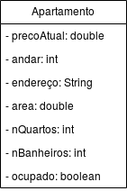
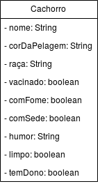
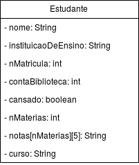
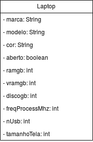
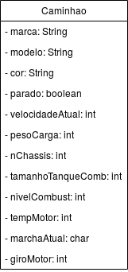
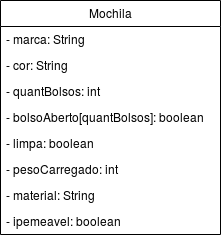

## Apartamento
Apartamento contendo um preço atual (considerando mudança de preço em caso de valorização), um andar onde está localizado, um endereço, uma área em m², um número de quartos e de banheiros e um estado de ocupado ou não, caso hajam moradores vivendo nele:

## Cachorro
Um cachorro que pode ter um nome, uma cor de pelagem, uma raça, pode estar vacinado ou não, pode estar com fome ou com sede, pode estar em humores diferentes, pode estar limpo ou não, assim como pode ter um dono ou não:

## Estudante
Um estudante com um nome, uma instituição onde estuda e seu número de matrícula nesta instituição. Ele também possui uma conta na biblioteca, um estado de cansaço, o número de matérias que faz, o curso que faz na instituição e uma tabela de notas, onde a primeira coluna desta tabela é o nome da matéria específica e cada coluna seguinte é uma nota na mesma:

## Laptop
Um laptop com uma marca, modelo e cor. Com uma tela que pode estar aberta ou não. Uma quantidade (em GB) de ram, memória de vídeo dedicada e disco rígido. Uma velocidade de processamento (em MHz), o número de portas USB e o tamanho da tela em polegadas:

## Caminhão 
Um caminhão com marca, modelo e cor. Há um estado parado que indica se o caminhão está em movimento, uma velocidade atual assim como o peso da carga e o número do chassis.
O volume do tanque de combustível é uma das suas características, assim como o atual nível de combustível, que tem como valor máximo a característica anterior.
Outras características listáveis são a temperatura e o giro do motor, assim como a marcha atual:

## Mochila
Uma mochila com uma marca e cor. Há uma quantidade de bolsos, assim como um vetor que representa quantos vetores estão abertos. Ela pode estar limpa ou não.
Ela carrega um pesso em kilogramas, possui um material de fabricação e um status de ipemeabilidade:

