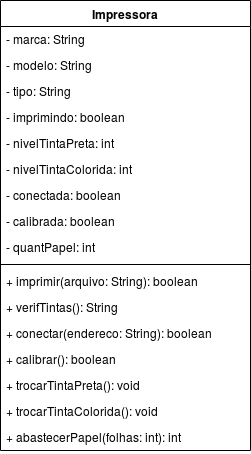

## Impressora
### Características:
A impressora possui uma marca, um modelo, e um tipo de impressão, determinado pelo o que usa para imprimir na folha.
Possui um estado imprimindo e níveis de tinta colorida e preta.
A impressora está conectada ou não à um dispositivo que pode mandar algo a ser imprimido.
O aparelho pode estar calibrado ou não, assim como possui um número de papéis para impressão.

### Comportamentos:
A impressora pode imprimir uma quantidade de caracteres, e retorna um sinal se a impressão foi bem sucedida. A impressora pode verificar o nível de tinta de seus cartuchos, retornando o nível da cada um deles em uma frase.
Pode se conectar à um dispositivo com um endereço determinado, retornando um sinal caso a conexão tenha sido bem feita.
A impressora pode realizar a calibragem de seus aparelhos, retornando um sinal caso a calibragem tenha sido bem efetuada.
Além disso, a impressora pode trocar o cartucho da tinta preta, trocar o cartucho da tinta colorida e abastecer-se com folhas novas, recebendo um número determinado de folhas e retornando a quantidade final.

